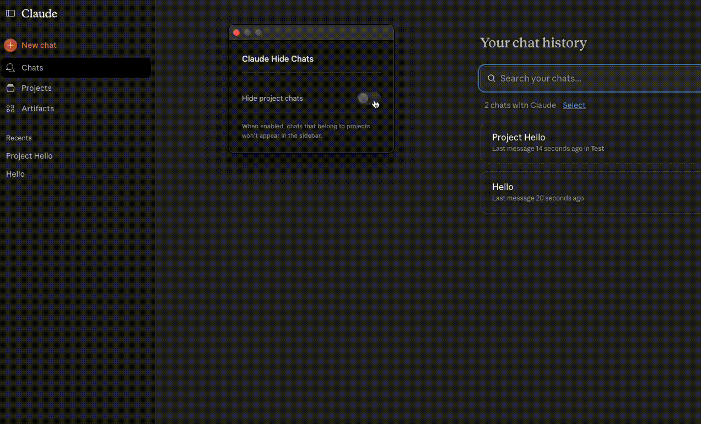

# Claude Hide Chats

A Chrome extension to hide project chats from Claude's sidebar.

## Demo

## Features

- Automatically hides chats that belong to projects
- Starred chats remain visible
- Toggle on/off with a simple switch
- Minimal dark interface
- No data collection

## Installation

1. Clone this repository
2. Open `chrome://extensions/`
3. Enable Developer mode
4. Click "Load unpacked"
5. Select the extension folder

## Usage

Click the extension icon in your toolbar to toggle hiding project chats. When enabled, all chats belonging to Claude projects will be hidden from the sidebar.

## How it works

The extension detects which chats belong to projects by checking the `project_uuid` field from Claude's API and hides them from the sidebar.

## Troubleshooting

If the extension doesn't work after installation, try reloading the Claude page (Ctrl/Cmd + R).
